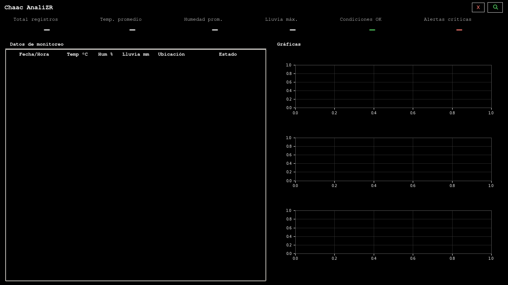
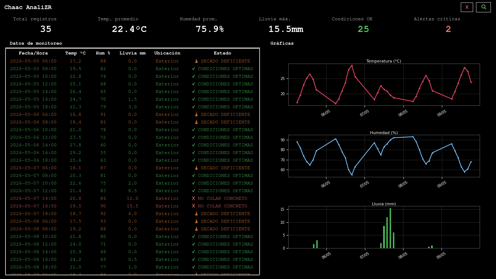

# CHAAC ANALIZR
## Sistema de Monitoreo Ambiental para Obra Civil

Proyecto desarrollado para el curso **Programación para la Ciencia e Ingeniería**  
Universidad Mariano Gálvez de Guatemala — Campus Antigua

---

## ¿Qué hace?

CHAAC ANALIZR carga registros climáticos desde un archivo CSV y analiza automáticamente:

- Temperatura ambiente
- Humedad relativa
- Precipitación pluvial

Con base en esos datos, el sistema emite alertas técnicas para decidir si las condiciones son aptas para colar concreto.

---

## Capturas

### Interfaz al iniciar


### Sistema con datos cargados


---

## Cómo ejecutar

### Requisitos
- Python 3.x
- matplotlib

### Instalación
```bash
pip install matplotlib
```

### Ejecución
```bash
python main_gui.py
```

---

## Formato del archivo CSV

```csv
fecha_hora,temperatura_C,humedad_pct,lluvia_mm,ubicacion
2026-05-22 06:00,18.0,78,0.0,Exterior
2026-05-22 08:00,23.0,66,0.0,Exterior
2026-05-22 10:00,27.0,60,0.0,Exterior
2026-05-22 14:00,26.0,66,5.9,Exterior
```

---

## Sistema de alertas

| Estado | Condición |
|---|---|
| ✔ CONDICIONES OPTIMAS | Temp. entre 10°C y 35°C, humedad < 85%, lluvia < 10 mm |
| ⚠ SECADO DEFICIENTE | Humedad ≥ 85% |
| ✖ NO COLAR CONCRETO | Lluvia ≥ 10 mm o temperatura fuera de rango |

---

## Arquitectura

```
Chaac-Analizr/
├── main_gui.py              # Interfaz gráfica (clase App)
├── analizador.py            # Lógica de análisis y alertas (clase Analizador)
├── registro_climatico.py    # Lectura del CSV (clase RegistroClimatico)
├── lectura.py               # Modelo de datos (clase Lectura)
├── datos_climaticos.csv     # Ejemplo de archivo de datos
└── README.md
```

---

## Clases

### Lectura
Representa una medición individual. Convierte los datos crudos del CSV al tipo correcto.

| Atributo | Tipo |
|---|---|
| fecha_hora | datetime |
| temperatura_C | float |
| humedad_pct | float |
| lluvia_mm | float |
| ubicacion | str |

### RegistroClimatico
Abre el CSV con `csv.DictReader` y crea un objeto `Lectura` por cada fila.

### Analizador
Evalúa cada lectura contra umbrales técnicos del concreto definidos como constantes de clase.

```python
TEMP_MAX_CONCRETO  = 35.0
TEMP_MIN_CONCRETO  = 10.0
HUMEDAD_MAX_SECADO = 85.0
LLUVIA_CRITICA     = 10.0
```

### App
Interfaz gráfica que hereda de `tk.Tk`. Coordina los demás módulos y muestra tabla, métricas y gráficas.

---

## Conceptos aplicados

| Concepto | Uso |
|---|---|
| Clases y objetos | Lectura, RegistroClimatico, Analizador, App |
| Herencia | `App` hereda de `tk.Tk` |
| Encapsulamiento | Cada clase expone solo lo necesario |
| Constantes de clase | Umbrales técnicos en Analizador |
| CSV | Lectura de datos con `csv.DictReader` |
| datetime | Conversión y manejo de fechas |
| matplotlib | Gráficas embebidas en tkinter |
| try / except | Manejo de errores al cargar CSV |

---

## Captura de datos

Los datos fueron obtenidos manualmente desde **AccuWeather**, consultando temperatura, humedad y lluvia por horas para Antigua Guatemala, Sacatepéquez. Los valores se transcribieron al archivo CSV al final de cada jornada.

---

## Autor

**Eduardo Alejandro García González**  
Carné: 1010-26-22427  
Ingeniería Civil — Universidad Mariano Gálvez de Guatemala
